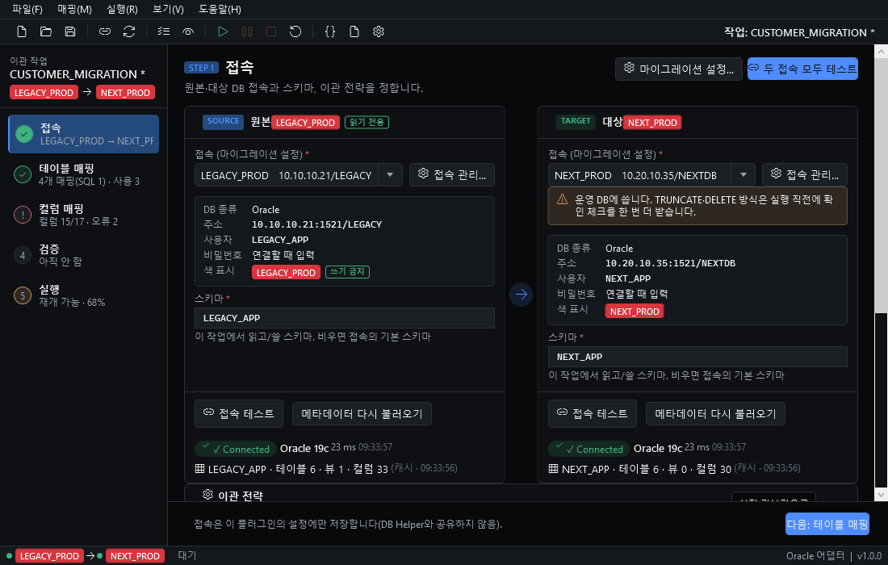
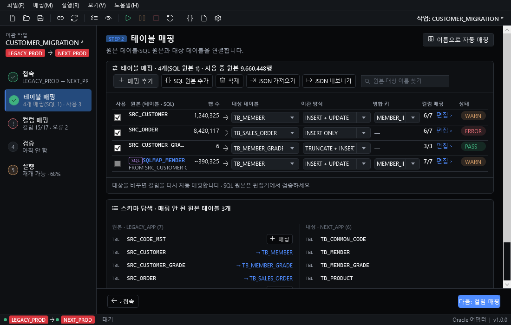
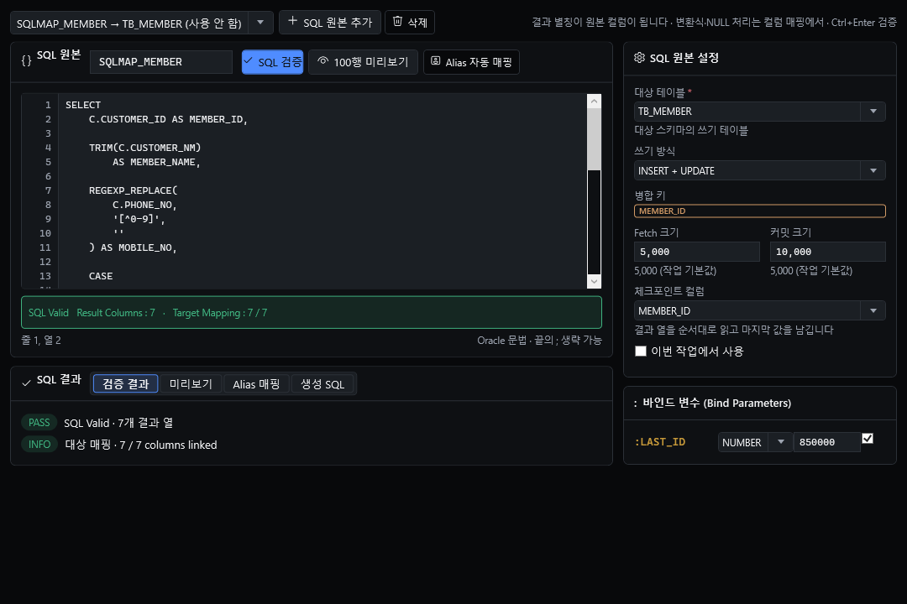
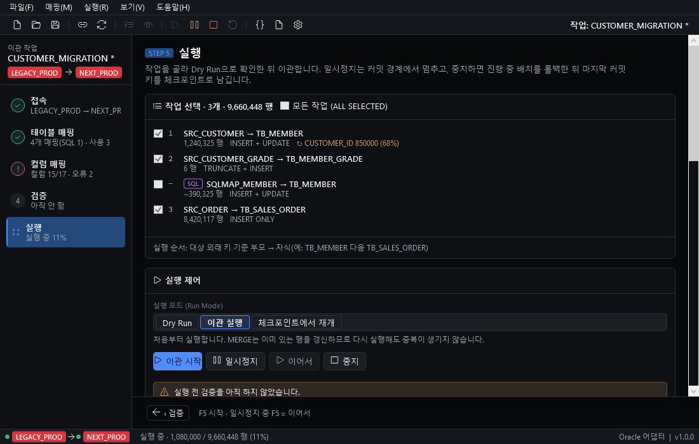

# Folderss Oracle Migration Studio

[Folderss](https://github.com/zaruous/Folderss)용 플러그인 — **Oracle → Oracle 데이터 이관**을 접속부터 검증까지 한 화면 흐름(5단계)으로 처리합니다. 이관은 하위 프로세스(에이전트)가 수행하므로 Folderss 창을 닫아도 계속됩니다.

| 접속 | 테이블 매핑 |
|---|---|
|  |  |
| **SQL 원본 편집기** | **실행** |
|  |  |

## 설치

요구 사항: Windows 10 이상, .NET 8 Desktop Runtime(Folderss가 이미 필요로 함), 원본·대상 Oracle 11g 이상에 접속 가능할 것.

- **GitHub에서 설치**: Folderss `설정 > 플러그인 > GitHub에서 설치…`에 `https://github.com/zaruous/Folderss-oracle-data-migration` 입력
- **zip으로 설치**: [Releases](https://github.com/zaruous/Folderss-oracle-data-migration/releases)의 `zaruous.folderss-oracle-migration-<버전>.zip`을 받아 `플러그인 찾기…`로 등록 후 Folderss 재시작

## 빠른 시작

1. `⋯ > 플러그인 > Migration Studio`
2. 마이그레이션 설정에서 원본·대상 접속 추가
3. **접속** 단계에서 접속 → 메타데이터 읽기
4. **테이블 매핑** — 자동 매칭으로 원본↔대상 짝짓기
5. **컬럼 매핑** — 변환식·NULL 처리 지정
6. **검증**(`F6`) — 실행 전 점검
7. **실행** — Dry Run → 이관 → 실행 후 검증

## 기능

| 영역 | 내용 |
|---|---|
| 접속·이관 전략 | 접속별 환경 색(운영=빨강 등), 원본 전용(쓰기 금지) 접속, 작업별 전략(INSERT ONLY / MERGE / TRUNCATE+INSERT / DELETE+INSERT) |
| 테이블·SQL 원본 매핑 | 테이블·뷰·SQL 원본을 대상 테이블에 매핑, 자동 매칭, 외래 키 기준 실행 순서 |
| 컬럼 매핑 | 변환식, NULL 처리, 신규 NOT NULL 열 기본값, 형식 호환 검사 |
| SQL 원본 편집기 | `SELECT`·`WITH`만 허용, Ctrl+Enter 검증, 결과 열·Alias 확인 |
| 검증 | 실행 전 C01~C13, 실행 후 P01~P06(행 수·키·샘플 비교·거부 행 요약 등) |
| 실행 | Dry Run, 일시정지·이어서·중지, 병렬 작업자, 재시도, 오류 테이블 |
| 체크포인트 | 마지막 커밋 키에서 재개(대상 DB 제어 테이블 또는 로컬 파일) |
| 증분 이관 | 실행 방식 `증분 이관`: 매핑의 체크포인트 열 기준으로 지난 실행의 마지막 키(워터마크) 다음 행만 읽고 끝에 워터마크를 올림. 워터마크가 없으면 처음부터(첫 적재). TRUNCATE+INSERT·체크포인트 열 없는 매핑은 실행 전 검증 `증분 기준`에서 ERROR |
| 작업 파일 | JSON·YAML 저장, 템플릿 내보내기·가져오기 |
| 에이전트 | 하위 프로세스(`MigrationAgent.exe`), 이름 있는 파이프로 상태·로그 전달 |

## 단축키

| 키 | 동작 |
|---|---|
| `Ctrl+1` … `Ctrl+5` | 단계 이동 |
| `Ctrl+Q` | SQL 원본 편집기 |
| `Ctrl+O` / `Ctrl+S` / `Ctrl+Shift+S` | 작업 열기 / 저장(JSON) / YAML로 저장 |
| `F6` | 실행 전 검증 |
| `F5` | 이관 시작 · 일시정지 중이면 이어서 |
| `Ctrl+Enter` | SQL 원본 편집기: SQL 검증 |
| `Alt+F·M·R·V·H` | 메뉴 열기 |

## 안전장치

- 원본 세션은 읽기 전용(`SET TRANSACTION READ ONLY` + SELECT). SQL 원본도 `SELECT`·`WITH`만 받습니다.
- **쓰기 금지(원본 전용)** 를 켠 접속은 대상으로 고를 수 없습니다.
- `TRUNCATE + INSERT`, `DELETE + INSERT`는 실행 직전 확인 창에서 체크해야 실행 버튼이 켜집니다. 대상이 운영(빨강)이면 미리 경고합니다.
- 실행 전 검증 ERROR가 고른 작업에 있으면 이관 실행을 막습니다(Dry Run은 허용). 검증 뒤 작업을 바꾸면 실행 때 다시 묻습니다.
- 실행 중에는 새 작업·열기·템플릿 가져오기를 막습니다.

**접속 정보 저장**: 비밀번호는 Windows DPAPI(현재 사용자)로 암호화해 저장하며 DB Helper와 공유하지 않습니다. 비밀번호는 파일·로그·에이전트 명령줄에 평문으로 남지 않습니다(에이전트에는 파이프로 전달).

## 체크포인트 저장소 선택 가이드

체크포인트는 "여기까지는 대상에 확실히 들어갔다"는 표시(마지막 커밋된 배치의 마지막 키)입니다. 중지·장애 후 재개하면 그 다음 키부터 다시 읽습니다. `설정 > 기본값 > 체크포인트 저장소`에서 고릅니다.

| | 자동(기본) | 대상 DB | 로컬 파일 |
|---|---|---|---|
| 동작 | 제어 테이블을 만들 수 있으면 대상 DB, 아니면 로컬 | 배치 쓰기와 체크포인트를 **같은 트랜잭션**에서 COMMIT | 대상에 COMMIT한 **뒤에** 파일 기록 |
| 도중 장애 | — | 어긋나지 않음 | 한 배치를 다시 처리할 수 있음 |
| 필요한 것 | — | 대상 스키마에 `MIG_RUN`·`MIG_RUN_TASK`·`MIG_CHECKPOINT`(CREATE TABLE 권한 또는 DBA가 미리 생성) | 없음 |
| 다른 PC에서 재개 | — | 가능 | 불가 |

로컬 파일로 돌 때 INSERT ONLY 작업은 재개 직후 첫 배치만 MERGE로 써서 중복 키 오류를 흡수합니다.

## 에이전트

이관은 `MigrationAgent.exe`(하위 프로세스)가 수행합니다. UI가 멈추거나 창을 닫아도 이관이 계속되고, 플러그인을 다시 열면 실행 중인 에이전트에 **다시 붙습니다**. `설정 > 에이전트`의 "Folderss를 닫을 때" 옵션으로 종료 시 동작을 정합니다.

데이터 위치: `%LOCALAPPDATA%\Folderss\plugin-data\zaruous.folderss-oracle-migration\` 아래 `agent`, `runs`, `logs`, `checkpoints`, `metadata`, `jobs`. 실행 로그는 `logs`에 남습니다.

## 문제 해결

| 증상 | 확인 |
|---|---|
| ORA-12514 / ORA-12541 | 서비스 이름·리스너 주소/포트가 맞는지 확인(호스트:포트/서비스명) |
| ORA-01017 | 사용자·비밀번호 오류. 비밀번호를 저장하지 않은 접속은 실행 때 다시 입력 |
| ORA-12170 | 네트워크·방화벽으로 접속 시간 초과 |
| 에이전트가 시작되지 않음 | 보안 소프트웨어가 `agent\MigrationAgent.exe`를 차단한 경우 예외 등록 |
| 체크포인트 저장소를 만들 수 없음 | 대상 스키마 CREATE TABLE 권한 확인, 없으면 DBA가 `MIG_*` 테이블을 미리 생성하거나 로컬 파일 사용 |
| 지원하지 않는 열 형식 | LONG·XMLTYPE 등은 변환식으로 바꾸거나 매핑에서 제외 |
| 메타데이터 읽기가 느림 | 통계·딕셔너리 조회 권한과 스키마 크기 확인 |

## 한계

- 실행은 Oracle → Oracle만 지원합니다(어댑터 경계는 분리되어 있음).
- CDC(변경 데이터 캡처)는 지원하지 않습니다.
- SQL 편집기는 구문 강조가 없는 일반 텍스트 상자입니다.
- 비밀번호 암호화(DPAPI)는 Windows 사용자 단위입니다(다른 PC·사용자와 공유 불가).
- 실행 전 검증 C06(NLS 바이트 길이 보정)은 아직 보정하지 않습니다.

## 개발

```powershell
dotnet build MigrationStudio.sln -c Release --nologo --no-incremental
dotnet test tests/MigrationStudio.Tests -c Release --nologo

# Oracle 통합 시험(docker oracle-12c 등 접속 가능한 DB, ORACLE_IT_DSN 없으면 건너뜀)
$env:ORACLE_IT_DSN = "localhost:1521/xe"
dotnet test tests/MigrationStudio.OracleIT -c Release --nologo

# 배포 zip(검증 포함) → release\zaruous.folderss-oracle-migration-<버전>.zip
.\scripts\pack.ps1 -Test

# 화면 레이아웃 자동 검사(화면 × 테마 × 크기)
.\scripts\layout-check.ps1
```

- `tools/DevHost` — Folderss 없이 화면을 띄우고 스크린샷을 찍는 검수 도구(`--seed --fake-oracle --step N --shot 파일.png` 등)
- `tools/AgentCli` — 에이전트를 터미널에서 실행·제어
- 설계: [`docs/design-docs`](docs/design-docs/README.md) (화면 설계서 UI-MIG-001~008), 구현 지시서: [`docs/dev`](docs/dev/00-common.md)

## 라이선스

[MIT](LICENSE)
